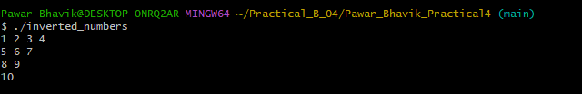
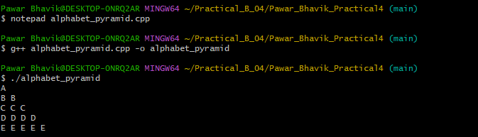
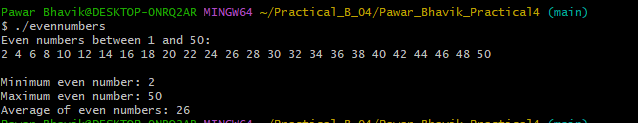

# Cloud Computing with DevOps Practical

---

## Students Information

| Name | Enrollment Number | Practical Set |
|------|-------------------|---------------|
| Pawar Bhavik | 202504104610070 | Set A |
| Deriya Shvet | 202504104610069 | Set B |

---

## Logos

### University Logo

### Department Logo

---

## Subject
Cloud Computing with DevOps

---

## Practical Overview

This repository contains practical exercises and assignments related to Cloud Computing with DevOps.

It includes C++ programs such as:

- Inverted Number Pattern
- Alphabet Pyramid Pattern
- Even Numbers Program (1–50)

---

## Notes

- Each practical task is organized in separate folders.
- Images and documentation are included for better understanding.
- Git commands such as clone, add, commit, and push were used in this project.

---

## Output Screenshots

### Inverted Number Pattern

### Alphabet Pyramid Pattern

### Even Numbers Program
